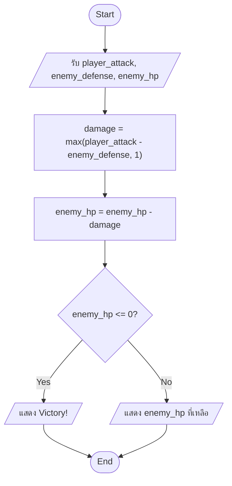
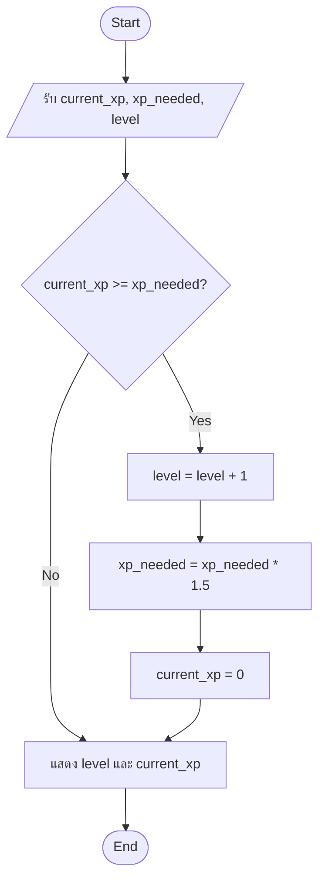
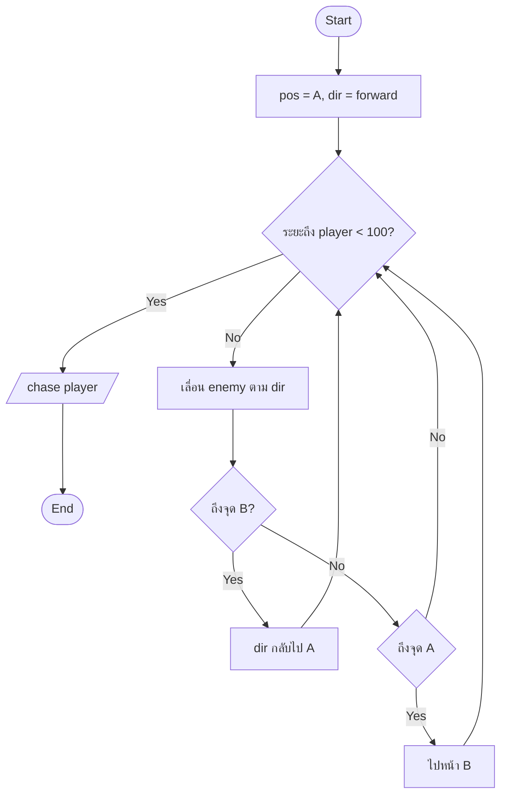

```mermaid
flowchart TD
Start([Start]) --> Input[/รับ player_attack, enemy_defense, enemy_hp/]
Input --> Calc["damage = max(player_attack - enemy_defense, 1)"]
Calc --> Reduce["enemy_hp = enemy_hp - damage"]
Reduce --> D1{enemy_hp <= 0?}
D1 --> |Yes| Win[/แสดง Victory!/]
D1 --> |No| Show[/แสดง enemy_hp ที่เหลือ/]
Win & Show --> End([End])
```

---

```mermaid
flowchart TD
Start([Start]) --> Input[/รับ current_xp, xp_needed, level/]
Input --> Dpxp{current_xp >= xp_needed?}
Dpxp --> |Yes| level[level = level + 1]
Dpxp --> |No| Show[แสดง level และ current_xp]
level --> Xp[xp_needed = xp_needed * 1.5]
Xp --> Cr[current_xp = 0]
Cr --> Show[แสดง level และ current_xp]
Show --> End([End])
```

---

```mermaid
flowchart TD
Start([Start]) --> Input[pos = A, dir = forward]
Input --> Range{ระยะถึง player < 100?}
Range --> |Yes| Chase[/chase player/]
Chase --> End([End])
Range --> |No| En[เลื่อน enemy ตาม dir]
En --> B{ถึงจุด B?}
B --> |Yes| Back[dir กลับไป A]
Back --> Range{ระยะถึง player < 100?}
B --> |No| A{ถึงจุด A}
A --> |Yes| DB[ไปหน้า B]
DB --> Range{ระยะถึง player < 100?}
A --> |No| Range{ระยะถึง player < 100?}
```
